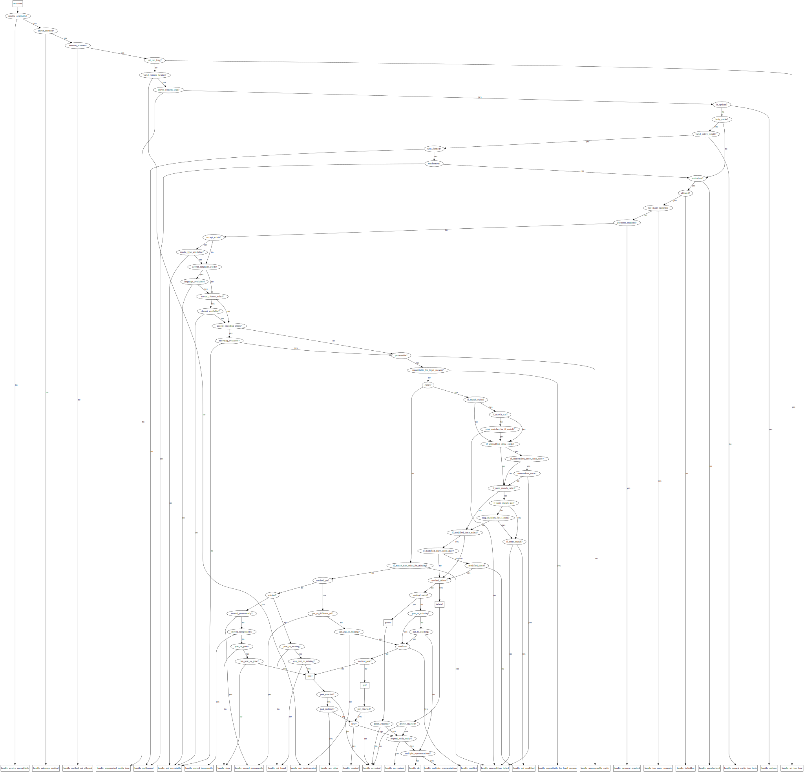

<!--
SPDX-FileCopyrightText: 2021 Rosa Richter

SPDX-License-Identifier: MIT
-->

# Decision Tree

There are a lot of decision to be made before Liberator sends a response.
This is the current state of Liberator's decision tree, with handlers at the bottom.



## Creating your own chart

You can create Graphviz source code for your own decision tree using the `liberator.chart` mix task.

```sh
mix liberator.chart -o mychart.dot MyApp.MyResource
```

You will have to install [Graphviz](https://graphviz.org/)
or use one of its many language bindings to generate the actual image.
Unfortunately, there isn't a binding for Elixir or Erlang.
